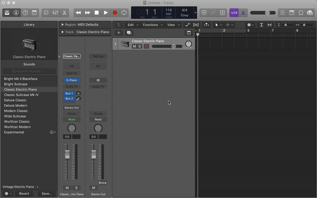

# [T3chFlicks](https://t3chflicks.org): BPM Counter Widget

> An web app/OSX dashboard app for counting BPM

---

## `tutorials`

## Usage (Non Safari Users)
Open any of the the `.html` files in your browser.

## Usage (Safari Users)
Open `bpm_without_sound.html` in safari. Right click (control click) and click add to dashboard.

Simple as that!

Now, when you want to use it just open by pressing F12.

# HAVE FUN

---

This project was created by [T3chFlicks](https://t3chflicks.org) - A tech focused education and services company.

---